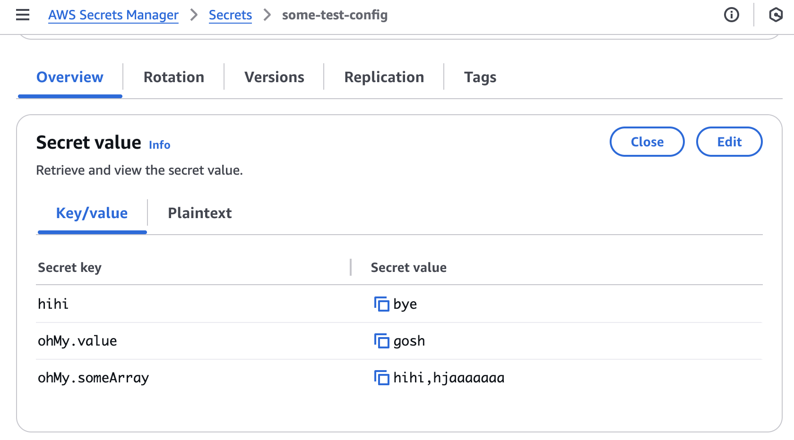

# secrets-manager-to-config

## Upload ts-file as Secret

When we choose to version our secrets by code, this package aims at managing secrets saved in `ts` format, so that UAT, PROD etc environments can infer their type from DEV config.

Assume that we have the following env config:

```ts
// config/test.ts

const someConfig: {
  hihi: string;
  ohMy: {
    value: string;
    someArray: string[];
  };
} = {
  hihi: "bye",
  ohMy: {
    value: "gosh",
    someArray: ["hihi", "hjaaaaaaa"],
  },
};

export default someConfig;
```

Then create a file called `upload.ts`:

```ts
// upload.ts

import { SecretConfig, uploadConfig } from "secrets-manager-to-config";

const secretConfig: SecretConfig = {
  awsRegion: "ap-southeast-2",
};

uploadConfig(secretConfig);
```

Now when we execute

```bash
ts-node upload-secret.ts --secret_name some-test-config --ts_path config/test.ts
```

We have the following in secret manager:

<a href="src/images/secrets.png"><a>

## Dwonload Secrets

Assume that in AWS secret manages we have defined a secret `abc` with `a.b.c = "123"`, then create a file `download.ts` and write

```ts
// download.ts

import { downloadConfig, SecretConfig } from "secrets-manager-to-config";

const secretConfig: SecretConfig = {
  awsRegion: "ap-southeast-2",
};

downloadConfig(secretConfig);
```

now you can pull your secret into nested `json` or `yml` or `flat_env` by

```js
ts-node download.ts --secret_name abc --format yml --save_at test.yml
```

Here the `format` is of type `json | yml | flat_env`. The above results in

- In `yml` format:

  ```yml
  # test.yml

  a:
    b:
      c: "123"
  ```

  This is suitable for spring boot project where we use `application.yml`.

- In `json` format:

  ```json
  {
    "a": {
      "b": {
        "c": "123"
      }
    }
  }
  ```

  This is suitable for `nodejs` project where we use `env-cmd -f .env.json` to load `env` config.

- In `flat_env` format:
  ```env
  a.b.c="123"
  ```
  This is suitable for ordinary `.env` files or application.properties for spring boot project.
